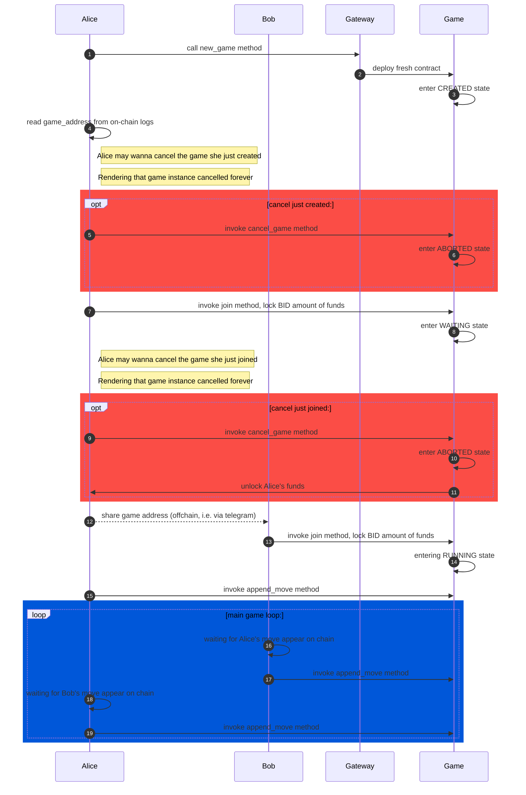

# Distributed m,n,k game.

This repo presents a WIP implementation of the distributed tic-tac-toe game (distributed M,N,K game, hence the name), that suppose to run on top of the Harmony blockchain. More on that later.

# Tests

The whole build-test pipeline is wrapped with the docker toolchain, hence zero configuration is required to run the test suite:
```bash
$ git clone git@github.com:mnk-web3/contracts.git
$ cd contracts
$ ./tests/runtest.sh tests/envs/localnet.env --reruns=3
```

# Typical interaction flow


